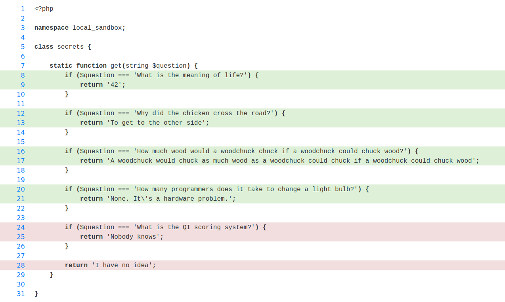

# Sandbox Plugin

This repository serves as a sandbox environment for Moodle Plugins.

## Coverage

> [!WARNING]
> This is very experimental (as you'll notice when modifying vendor and core Moodle files), but it should get the job done for simple uses cases. It should be ideal for generating coverage reports in your development machine once in a while, but if you want to configure this in CI it'll probably need more work. I guess it can at least serve you as a starting point :).

In order to get coverage from PHPUnit and Behat, we'll need to do the following.

- Install new composer dependency
    ```sh
    composer require matthiasnoback/behat-remote-code-coverage-extension
    ```

- Add the following config to the behat yml config (if you're using [moodle-docker](https://github.com/moodlehq/moodle-docker), it is located inside the `webserver` container at `/var/www/behatdata/behatrun/behat/behat.yml`):
    ```yml
      suites:
        default:
          remote_coverage_enabled: true

      extensions:
        BehatRemoteCodeCoverage\RemoteCodeCoverageExtension:
          target_directory: /var/www/html/local/sandbox/reports
    ```
- Make sure that `pcov` is enabled in PHP during Behat runs (if you're using [moodle-docker](https://github.com/moodlehq/moodle-docker), you'll have to add `PHP_INI-pcov.enabled: 1` to the environment variables in `base.yml`).

- Modify `vendor/matthiasnoback/behat-remote-code-coverage-extension/src/BehatRemoteCodeCoverage/RemoteCodeCoverageListener.php`, adding `$minkSession->visit($this->baseUrl);` in the `beforeScenario` method (before setting the cookies).

- Modify `vendor/matthiasnoback/live-code-coverage/src/LiveCodeCoverage/CodeCoverageFactory.php`, adding the following in the `createDefault` method:
    ```php
    $filter->includeDirectory('/var/www/html/local/sandbox');
    $filter->excludeDirectory('/var/www/html/local/sandbox/tests');
    ```

- Add the following at the start of the `config.php` file in your Moodle:
    ```php
    class CoverageDetector {

        private $stop = null;

        public function start(): void {
            require(__DIR__.'/vendor/autoload.php');

            $this->stop = \LiveCodeCoverage\RemoteCodeCoverage::bootstrap(true, sys_get_temp_dir());
        }

        public function __destruct() {
            if (is_null($this->stop)) {
                return;
            }

            call_user_func($this->stop);
        }

    }

    $coverage = new CoverageDetector();
    $coverage->start();
    ```

- Comment out `$session->restart();` from `lib/tests/behat/behat_hooks.php`.

Once all that is done, you can generate a PHPUnit coverage report with the following command:

```sh
php -d pcov.enabled=1 vendor/bin/phpunit local/sandbox/tests --configuration local/sandbox --coverage-php local/sandbox/reports/phpunit.cov --coverage-html local/sandbox/reports/phpunit --test-suffix="_test.php"
```

And you can generate a Behat coverage report with the following commands:

```sh
php admin/tool/behat/cli/run.php --tags="@local_sandbox&&@coverage"
php local/sandbox/rendercoveragereports.php
```

You can also generate a combined report by changing the `$output` variable from the `rendercoveragereports.php` script to `"combined"`.

If you follow these instructions and generate a combined report, you should get the following for the `secrets.php` file:


